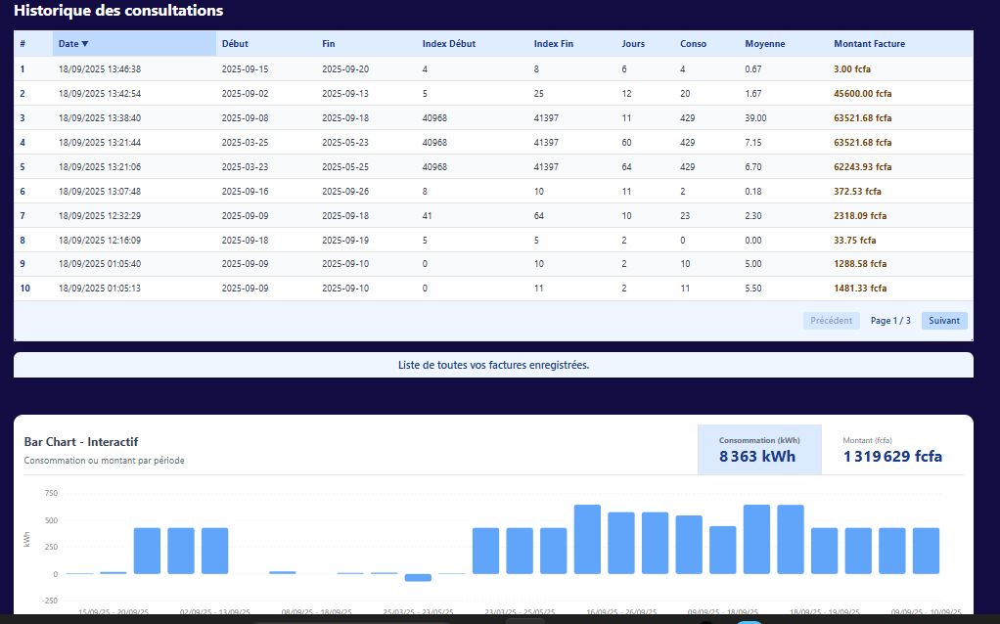
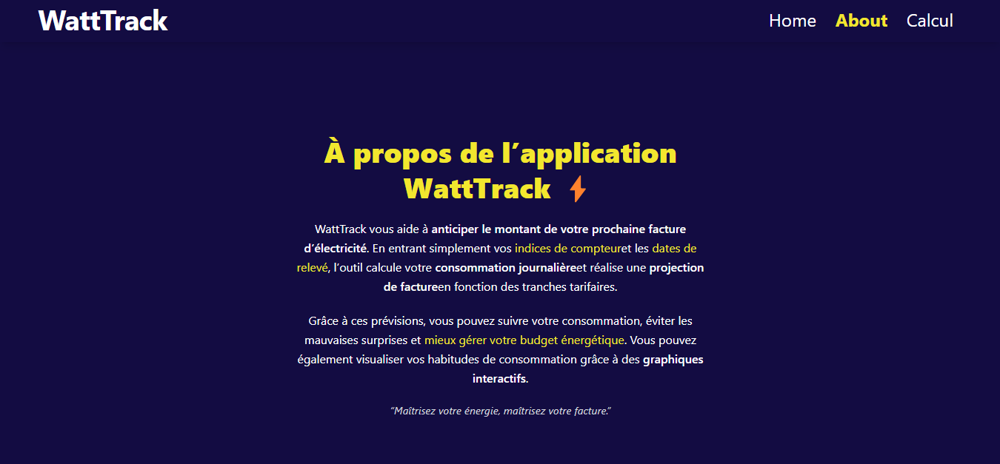

# WattTrack ⚡

> **Anticipez et visualisez votre facture d’électricité !**

WattTrack est une application web moderne qui vous permet de suivre, simuler et anticiper le montant de votre prochaine facture d’électricité. Grâce à une interface intuitive, vous pouvez saisir vos indices de compteur, visualiser votre historique de consommation et obtenir des projections précises, le tout accompagné de graphiques interactifs.

---


## 🚀 Fonctionnalités principales

- **Simulation de facture** : Entrez vos indices de compteur et dates de relevé pour obtenir une estimation détaillée de votre consommation et du montant à payer.
- **Ajout manuel de facture** : Ajoutez une facture à l'historique via un formulaire dédié.
- **Historique des consultations** : Visualisez l'ensemble de vos simulations avec tous les détails (dates, index, consommation, montant, etc.).
- **Export/Import de l'historique** : Exportez votre historique au format JSON pour le sauvegarder, et importez-le à tout moment pour le restaurer.
- **Graphiques interactifs** : Comparez visuellement votre consommation et le montant de vos factures sur vos dernières périodes.
- **Comparaison de périodes** : Simulez et comparez le montant de votre facture pour différentes durées de facturation (50 à 65 jours).
- **Interface responsive** : Design moderne, agréable et adapté à tous les écrans.

---

## 🖥️ Aperçu


---

## 🛠️ Technologies utilisées

- **React** (Vite)
- **Tailwind CSS** (design moderne et responsive)
- **Recharts** (graphiques interactifs)
- **LocalStorage** (sauvegarde locale de l’historique)

---

## ⚙️ Installation & Lancement

1. **Cloner le dépôt**

	```bash
	git clone https://github.com/BADZA99/WattTrack.git
	cd WattTrack
	```

2. **Installer les dépendances**

	```bash
	npm install
	```

3. **Lancer le serveur de développement**

	```bash
	npm run dev
	```

4. **Accéder à l’application**

	Ouvrez [http://localhost:5173](http://localhost:5173) dans votre navigateur.

---

## 📂 Structure du projet

```
prevision_elec/
├── public/
├── src/
│   ├── components/
│   │   ├── historique.jsx
│   │   ├── ConsoMontantBarChart.jsx
│   │   ├── FormulaireCalcul.jsx
│   │   └── ...
│   ├── pages/
│   │   ├── Calcul.jsx
│   │   ├── About.jsx
│   │   └── Home.jsx 
│   └── ...
├── utils/
│   └── operations.js
├── package.json
├── vite.config.js
└── README.md
```

---

## ✨ Exemples d’utilisation

- **Simulation rapide** :
  1. Rendez-vous sur l’onglet "Calcul".
  2. Saisissez vos dates et indices de compteur.
  3. Obtenez instantanément votre consommation, le montant estimé, et comparez différentes périodes.

- **Visualisation de l’historique** :
  - Consultez vos 3 dernières simulations et comparez-les graphiquement.

---


## 📸 Captures d’écran

### Accueil (desktop)


### Accueil (mobile)


### Ajout d'une facture (desktop)


### Simulation & Résultats (desktop)


### Simulation (mobile)


### Historique (desktop)


### Historique (mobile)


### À propos (desktop)


### À propos (mobile)


---

## 🤝 Contribuer

Les contributions sont les bienvenues !

1. Forkez le projet
2. Créez une branche (`git checkout -b feature/ma-nouvelle-fonctionnalite`)
3. Commitez vos modifications (`git commit -am 'Ajout d’une fonctionnalité'`)
4. Pushez la branche (`git push origin feature/ma-nouvelle-fonctionnalite`)
5. Ouvrez une Pull Request


---

## 👤 Auteur

- [BADZA99](https://github.com/BADZA99)
- Contact : pndiaye999@gmail.com

---

**WattTrack – Maîtrisez votre énergie, maîtrisez votre facture !**
# React + Vite

This template provides a minimal setup to get React working in Vite with HMR and some ESLint rules.

Currently, two official plugins are available:

- [@vitejs/plugin-react](https://github.com/vitejs/vite-plugin-react/blob/main/packages/plugin-react) uses [Babel](https://babeljs.io/) for Fast Refresh
- [@vitejs/plugin-react-swc](https://github.com/vitejs/vite-plugin-react/blob/main/packages/plugin-react-swc) uses [SWC](https://swc.rs/) for Fast Refresh

## Expanding the ESLint configuration

If you are developing a production application, we recommend using TypeScript with type-aware lint rules enabled. Check out the [TS template](https://github.com/vitejs/vite/tree/main/packages/create-vite/template-react-ts) for information on how to integrate TypeScript and [`typescript-eslint`](https://typescript-eslint.io) in your project.
